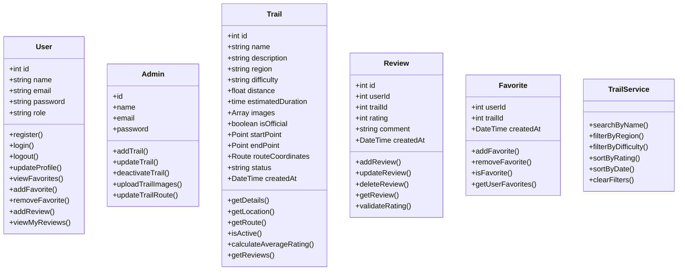

```mermaid
classDiagram
    class User {
        +int id
        +string name
        +string email
        +string password
        +string role
        +register()
        +login()
        +logout()
        +updateProfile()
        +viewFavorites()
        +addFavorite()
        +removeFavorite()
        +addReview()
        +viewMyReviews()
    }

    class Admin {
        +id
        +name
        +email
        +password
        +addTrail()
        +updateTrail()
        +deactivateTrail()
        +uploadTrailImages()
        +updateTrailRoute()
    }

    class Trail {
        +int id
        +string name
        +string description
        +string region
        +string difficulty
        +float distance
        +time estimatedDuration
        +Array images
        +boolean isOfficial
        +Point startPoint
        +Point endPoint
        +Route routeCoordinates
        +string status
        +DateTime createdAt
        +getDetails()
        +getLocation()
        +getRoute()
        +isActive()
        +calculateAverageRating()
        +getReviews()
    }

    class Review {
        +int id
        +int userId
        +int trailId
        +int rating
        +string comment
        +DateTime createdAt
        +addReview()
        +updateReview()
        +deleteReview()
        +getReview()
        +validateRating()
    }

    class Favorite {
        +int userId
        +int trailId
        +DateTime createdAt
        +addFavorite()
        +removeFavorite()
        +isFavorite()
        +getUserFavorites()
    }

    class TrailService {
        +searchByName()
        +filterByRegion()
        +filterByDifficulty()
        +sortByRating()
        +sortByDate()
        +clearFilters()
    }
```

