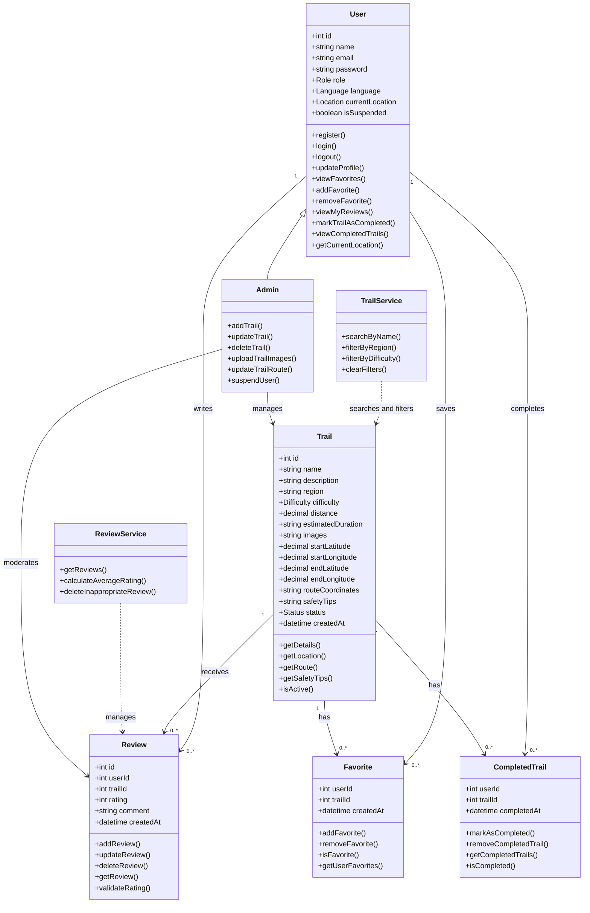
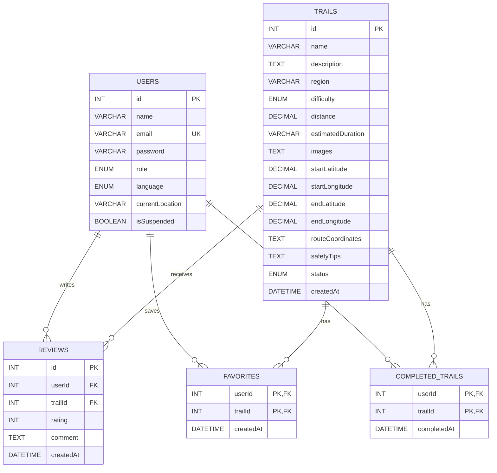

User Stories – Qimmah (قمة)
تطبيق استكشاف مسارات الهايكنج في السعودية
1. Must Have (المتطلبات الأساسية)
2. Create an Account
As a new user, I want to create an account with my email and password, so that I can save my activity and preferences.
2. Log In and Log Out
As a registered user, I want to log in and log out securely, so that my account stays protected.
3. Browse Trails as a Guest
As a guest, I want to browse trails without creating an account, so that I can explore the app before signing up.
4. Browse Hiking Trails
As a guest or registered user, I want to browse a list of hiking trails in Saudi Arabia, so that I can discover new places to hike.
5. Filter Trails
As a guest or registered user, I want to filter trails by region and difficulty level, so that I can find trails that suit my location and fitness.
6. View Trail Details
As a guest or registered user, I want to view a trail's details (distance, estimated duration, difficulty, description, and photos), so that I can decide if it's right for me.
7. View the Trail Starting Point on a Map
As a guest or registered user, I want to see the trail's starting point on a map, so that I can know how to get there.
2. Should Have (المتطلبات المهمة)
3. Search for Trails
As a guest or registered user, I want to search for a trail by name, so that I can quickly find a specific trail.
9. Read Reviews
As a guest or registered user, I want to read other users' reviews, so that I can get real feedback before going.
10. Prompt Guests to Sign Up
As a guest, I want to be prompted to sign up when I try to rate, review, or save a trail, so that I know an account is needed for these features.
11. Save Favorite Trails
As a registered user, I want to save trails to my favorites, so that I can return to them later.
12. Rate and Review Trails
As a registered user, I want to rate and review trails I've visited, so that I can share my experience with others.
13. Edit or Delete My Reviews
As a registered user, I want to edit or delete my own reviews, so that I can correct or remove what I wrote.
14. Manage Trails
As an admin, I want to add, edit, and delete trails, so that the trail information stays accurate and up to date.
15. Delete Inappropriate Reviews
As an admin, I want to delete inappropriate reviews, so that the content stays respectful and useful.
3. Could Have (المتطلبات الاختيارية)
4. Mark Trails as Completed
As a registered user, I want to mark trails as completed, so that I can track my hiking history.
17. Edit Account Information
As a registered user, I want to edit my account information, so that my profile stays up to date.
18. View Trail Safety Tips
As a guest or registered user, I want to see safety tips for each trail, so that I can prepare properly before hiking.
19. Share a Trail
As a guest or registered user, I want to share a trail link with friends, so that we can plan a hike together.
20. Switch App Language
As a guest or registered user, I want to switch the app language between Arabic and English, so that I can use it comfortably.
21. Suspend Users
As an admin, I want to suspend users who violate the rules, so that the community stays safe.
22. View and Update Current Location on the Trail Map
As a hiker, I want to see my current location on the trail map, updated periodically while hiking, so that I can check whether I am following the correct route.
4. Won't Have (هذه النسخة لن تتضمن)
5. View Live Weather
As a hiker, I want to see live weather conditions for the trail.
24. View Trail Elevation Profile
As a hiker, I want to see an elevation profile of the trail.
25. Offline Maps and Continuous GPS Tracking
As a hiker, I want to use offline maps and continuous GPS tracking in the background during the hike.

# Components, Classes, and Database Design

## 1. Back-end Classes

### User

**Attributes:**

* `id`
* `name`
* `email`
* `password`
* `role`
* `language`
* `currentLocation`
* `isSuspended`

**Methods:**

* `register()`
* `login()`
* `logout()`
* `updateProfile()`
* `viewFavorites()`
* `addFavorite()`
* `removeFavorite()`
* `viewMyReviews()`
* `markTrailAsCompleted()`
* `viewCompletedTrails()`
* `getCurrentLocation()`

### Trail

**Attributes:**

* `id`
* `name`
* `description`
* `region`
* `difficulty`
* `distance`
* `estimatedDuration`
* `images`
* `startLatitude`
* `startLongitude`
* `endLatitude`
* `endLongitude`
* `routeCoordinates`
* `safetyTips`
* `status`
* `createdAt`

**Methods:**

* `getDetails()`
* `getLocation()`
* `getRoute()`
* `getSafetyTips()`
* `isActive()`

### Review

**Attributes:**

* `id`
* `userId`
* `trailId`
* `rating`
* `comment`
* `createdAt`

**Methods:**

* `addReview()`
* `updateReview()`
* `deleteReview()`
* `getReview()`
* `validateRating()`

### Favorite

**Attributes:**

* `userId`
* `trailId`
* `createdAt`

**Methods:**

* `addFavorite()`
* `removeFavorite()`
* `isFavorite()`
* `getUserFavorites()`

### CompletedTrail

**Attributes:**

* `userId`
* `trailId`
* `completedAt`

**Methods:**

* `markAsCompleted()`
* `removeCompletedTrail()`
* `getCompletedTrails()`
* `isCompleted()`

### TrailService

**Attributes:**

* None

**Methods:**

* `searchByName()`
* `filterByRegion()`
* `filterByDifficulty()`
* `clearFilters()`

### ReviewService

**Attributes:**

* None

**Methods:**

* `getReviews()`
* `calculateAverageRating()`
* `deleteInappropriateReview()`

### Admin

Admin inherits from the `User` class and provides additional administrative functions.

**Methods:**

* `addTrail()`
* `updateTrail()`
* `deleteTrail()`
* `uploadTrailImages()`
* `updateTrailRoute()`
* `suspendUser()`

---

# 2. UML Class Diagram

---

# 3. Database Design

The system uses a relational database with the following tables:

### Users

| Field           | Type    | Key    |
| --------------- | ------- | ------ |
| id              | INT     | PK     |
| name            | VARCHAR |        |
| email           | VARCHAR | UNIQUE |
| password        | VARCHAR |        |
| role            | ENUM    |        |
| language        | ENUM    |        |
| currentLocation | VARCHAR |        |
| isSuspended     | BOOLEAN |        |

### Trails

| Field             | Type     | Key |
| ----------------- | -------- | --- |
| id                | INT      | PK  |
| name              | VARCHAR  |     |
| description       | TEXT     |     |
| region            | VARCHAR  |     |
| difficulty        | ENUM     |     |
| distance          | DECIMAL  |     |
| estimatedDuration | VARCHAR  |     |
| images            | TEXT     |     |
| startLatitude     | DECIMAL  |     |
| startLongitude    | DECIMAL  |     |
| endLatitude       | DECIMAL  |     |
| endLongitude      | DECIMAL  |     |
| routeCoordinates  | TEXT     |     |
| safetyTips        | TEXT     |     |
| status            | ENUM     |     |
| createdAt         | DATETIME |     |

### Reviews

| Field     | Type     | Key            |
| --------- | -------- | -------------- |
| id        | INT      | PK             |
| userId    | INT      | FK → Users.id  |
| trailId   | INT      | FK → Trails.id |
| rating    | INT      |                |
| comment   | TEXT     |                |
| createdAt | DATETIME |                |

### Favorites

| Field     | Type     | Key                |
| --------- | -------- | ------------------ |
| userId    | INT      | PK, FK → Users.id  |
| trailId   | INT      | PK, FK → Trails.id |
| createdAt | DATETIME |                    |

### CompletedTrails

| Field       | Type     | Key                |
| ----------- | -------- | ------------------ |
| userId      | INT      | PK, FK → Users.id  |
| trailId     | INT      | PK, FK → Trails.id |
| completedAt | DATETIME |                    |

---

# 4. ER Diagram

---

# 5. Front-end Components

The main front-end components are:

* **Home / Trail List**

  * Displays available hiking trails.
  * Provides access to search and filters.

* **Search Bar**

  * Searches trails by name.

* **Filter Component**

  * Filters trails by region.
  * Filters trails by difficulty.

* **Saudi Map**

  * Displays hiking trails across Saudi Arabia.
  * Allows users to select a trail marker.
  * Displays the trail starting point.
  * Displays the user's current location with periodic updates.

* **Trail Details**

  * Displays trail description, region, difficulty, distance, duration, images, and safety tips.

* **Trail Route Map**

  * Displays the trail route with start and end points.

* **Authentication**

  * Registration.
  * Login.
  * Logout.
  * Prompts guests to sign up when they try to save, rate, or review a trail.

* **Favorites**

  * Allows registered users to save and remove favorite trails.

* **Reviews & Ratings**

  * Displays reviews and average ratings.
  * Allows registered users to submit ratings and comments.
  * Allows users to edit or delete their own reviews.

* **Completed Trails*
