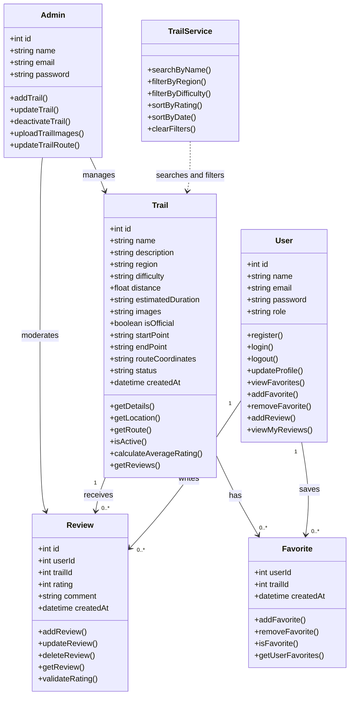
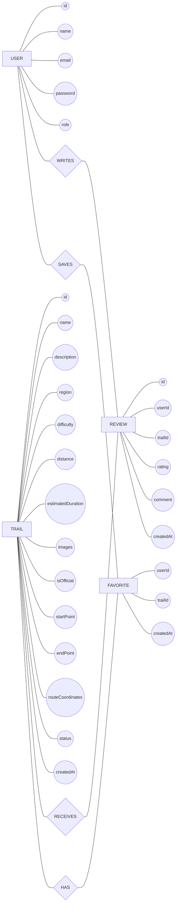

# Components, Classes, and Database Design

## 1. Back-end Classes

### User

**Attributes:**

* `id`
* `name`
* `email`
* `password`
* `role`

**Methods:**

* `register()`
* `login()`
* `logout()`
* `updateProfile()`
* `viewFavorites()`
* `addFavorite()`
* `removeFavorite()`
* `addReview()`
* `viewMyReviews()`

### Trail

**Attributes:**

* `id`
* `name`
* `description`
* `region`
* `difficulty`
* `distance`
* `estimatedDuration`
* `images`
* `isOfficial`
* `startPoint`
* `endPoint`
* `routeCoordinates`
* `status`
* `createdAt`

**Methods:**

* `getDetails()`
* `getLocation()`
* `getRoute()`
* `isActive()`
* `calculateAverageRating()`
* `getReviews()`

### Review

**Attributes:**

* `id`
* `userId`
* `trailId`
* `rating`
* `comment`
* `createdAt`

**Methods:**

* `addReview()`
* `updateReview()`
* `deleteReview()`
* `getReview()`
* `validateRating()`

### Favorite

**Attributes:**

* `userId`
* `trailId`
* `createdAt`

**Methods:**

* `addFavorite()`
* `removeFavorite()`
* `isFavorite()`
* `getUserFavorites()`

### TrailService

**Attributes:**

* None

**Methods:**

* `searchByName()`
* `filterByRegion()`
* `filterByDifficulty()`
* `sortByRating()`
* `sortByDate()`
* `clearFilters()`

### Admin

**Attributes:**

* `id`
* `name`
* `email`
* `password`

**Methods:**

* `addTrail()`
* `updateTrail()`
* `deactivateTrail()`
* `uploadTrailImages()`
* `updateTrailRoute()`

---

# 2. UML Class Diagram



---

# 3. Database Design

The system uses a relational database with the following main entities:

* `Users`
* `Trails`
* `Reviews`
* `Favorites`

### Users

| Field    | Type    | Key    |
| -------- | ------- | ------ |
| id       | INT     | PK     |
| name     | VARCHAR |        |
| email    | VARCHAR | UNIQUE |
| password | VARCHAR |        |
| role     | VARCHAR |        |

### Trails

| Field             | Type     | Key |
| ----------------- | -------- | --- |
| id                | INT      | PK  |
| name              | VARCHAR  |     |
| description       | TEXT     |     |
| region            | VARCHAR  |     |
| difficulty        | VARCHAR  |     |
| distance          | FLOAT    |     |
| estimatedDuration | VARCHAR  |     |
| images            | TEXT     |     |
| isOfficial        | BOOLEAN  |     |
| startPoint        | VARCHAR  |     |
| endPoint          | VARCHAR  |     |
| routeCoordinates  | TEXT     |     |
| status            | VARCHAR  |     |
| createdAt         | DATETIME |     |

### Reviews

| Field     | Type     | Key |
| --------- | -------- | --- |
| id        | INT      | PK  |
| userId    | INT      | FK  |
| trailId   | INT      | FK  |
| rating    | INT      |     |
| comment   | TEXT     |     |
| createdAt | DATETIME |     |

### Favorites

| Field     | Type     | Key    |
| --------- | -------- | ------ |
| userId    | INT      | PK, FK |
| trailId   | INT      | PK, FK |
| createdAt | DATETIME |        |

---

# 4. ER Diagram

The following ER diagram uses the traditional notation:

* **Rectangle** = Entity
* **Oval** = Attribute
* **Diamond** = Relationship



### Relationships

* A **User** can write many **Reviews**.
* A **Trail** can receive many **Reviews**.
* A **User** can save many **Favorites**.
* A **Trail** can be saved by many users through **Favorites**.

---

# 5. Front-end Components

The front-end consists of the following main UI components:

### Home / Trail List

* Displays available hiking trails.
* Provides access to search, filtering, and sorting.

### Search Bar

* Allows users to search for a trail by name.

### Filter Component

* Filters trails by region.
* Filters trails by difficulty.

### Sort Component

* Sorts trails by highest rating.
* Sorts trails by newest.

### Saudi Map

* Displays hiking trails on a map of Saudi Arabia.
* Allows users to select a trail marker and preview its information.

### Trail Details

Displays:

* Trail name
* Description
* Region
* Difficulty
* Distance
* Estimated duration
* Images
* Official approval status

### Trail Route Map

* Displays the hiking route.
* Shows the start point and end point of the trail.

### Authentication

* Register
* Login
* Logout

### Favorites

* Allows registered users to add trails to favorites.
* Allows users to remove trails from favorites.
* Displays saved trails.

### Reviews & Ratings

* Displays user reviews.
* Displays average trail rating.
* Allows registered users to submit a rating and comment.

### User Profile

* Displays user information.
* Displays saved favorite trails.
* Displays the user's reviews.

### Admin Dashboard

* Add new trails.
* Edit existing trails.
* Deactivate trails.
* Upload trail images.
* Update trail routes.
* Manage user reviews.

```
```
