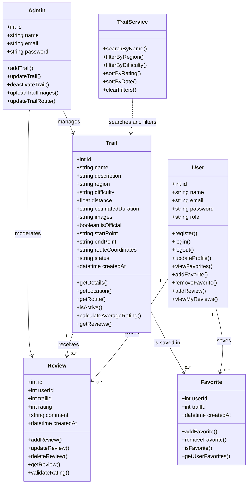
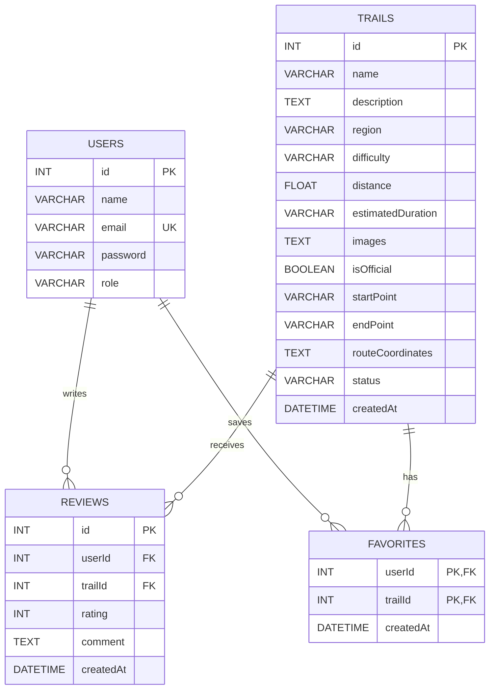

# Components, Classes, and Database Design

## 1. Back-end Classes

### User

**Attributes:**

* `id`
* `name`
* `email`
* `password`
* `role`

**Methods:**

* `register()`
* `login()`
* `logout()`
* `updateProfile()`
* `viewFavorites()`
* `addFavorite()`
* `removeFavorite()`
* `addReview()`
* `viewMyReviews()`

### Trail

**Attributes:**

* `id`
* `name`
* `description`
* `region`
* `difficulty`
* `distance`
* `estimatedDuration`
* `images`
* `isOfficial`
* `startPoint`
* `endPoint`
* `routeCoordinates`
* `status`
* `createdAt`

**Methods:**

* `getDetails()`
* `getLocation()`
* `getRoute()`
* `isActive()`
* `calculateAverageRating()`
* `getReviews()`

### Review

**Attributes:**

* `id`
* `userId`
* `trailId`
* `rating`
* `comment`
* `createdAt`

**Methods:**

* `addReview()`
* `updateReview()`
* `deleteReview()`
* `getReview()`
* `validateRating()`

### Favorite

**Attributes:**

* `userId`
* `trailId`
* `createdAt`

**Methods:**

* `addFavorite()`
* `removeFavorite()`
* `isFavorite()`
* `getUserFavorites()`

### TrailService

**Attributes:**

* None

**Methods:**

* `searchByName()`
* `filterByRegion()`
* `filterByDifficulty()`
* `sortByRating()`
* `sortByDate()`
* `clearFilters()`

### Admin

**Attributes:**

* `id`
* `name`
* `email`
* `password`

**Methods:**

* `addTrail()`
* `updateTrail()`
* `deactivateTrail()`
* `uploadTrailImages()`
* `updateTrailRoute()`

---

# 2. UML Class Diagram

---

# 3. Database Design

The system uses a relational database with the following tables:

### Users

| Field    | Type    | Key    |
| -------- | ------- | ------ |
| id       | INT     | PK     |
| name     | VARCHAR |        |
| email    | VARCHAR | UNIQUE |
| password | VARCHAR |        |
| role     | VARCHAR |        |

### Trails

| Field             | Type     | Key |
| ----------------- | -------- | --- |
| id                | INT      | PK  |
| name              | VARCHAR  |     |
| description       | TEXT     |     |
| region            | VARCHAR  |     |
| difficulty        | VARCHAR  |     |
| distance          | FLOAT    |     |
| estimatedDuration | VARCHAR  |     |
| images            | TEXT     |     |
| isOfficial        | BOOLEAN  |     |
| startPoint        | VARCHAR  |     |
| endPoint          | VARCHAR  |     |
| routeCoordinates  | TEXT     |     |
| status            | VARCHAR  |     |
| createdAt         | DATETIME |     |

### Reviews

| Field     | Type     | Key            |
| --------- | -------- | -------------- |
| id        | INT      | PK             |
| userId    | INT      | FK → Users.id  |
| trailId   | INT      | FK → Trails.id |
| rating    | INT      |                |
| comment   | TEXT     |                |
| createdAt | DATETIME |                |

### Favorites

| Field     | Type     | Key                |
| --------- | -------- | ------------------ |
| userId    | INT      | PK, FK → Users.id  |
| trailId   | INT      | PK, FK → Trails.id |
| createdAt | DATETIME |                    |

---

# 4. ER Diagram

---

# 5. Front-end Components

The main front-end components are:

* **Home / Trail List**

  * Displays available hiking trails.
  * Provides access to search, filters, and sorting.

* **Search Bar**

  * Searches trails by name.

* **Filter Component**

  * Filters trails by region.
  * Filters trails by difficulty.

* **Sort Component**

  * Sorts trails by rating.
  * Sorts trails by newest.

* **Saudi Map**

  * Displays hiking trails across Saudi Arabia.
  * Allows users to select a trail marker.

* **Trail Details**

  * Displays trail description, region, difficulty, distance, duration, images, and official approval status.

* **Trail Route Map**

  * Displays the trail route with start and end points.

* **Authentication**

  * Registration.
  * Login.
  * Logout.

* **Favorites**

  * Allows registered users to save and remove favorite trails.

* **Reviews & Ratings**

  * Displays reviews and average ratings.
  * Allows registered users to submit ratings and comments.

* **User Profile**

  * Displays the user's saved trails and reviews.

* **Admin Dashboard**

  * Add, edit, and deactivate trails.
  * Upload trail images.
  * Update trail routes.
  * Manage user reviews.
