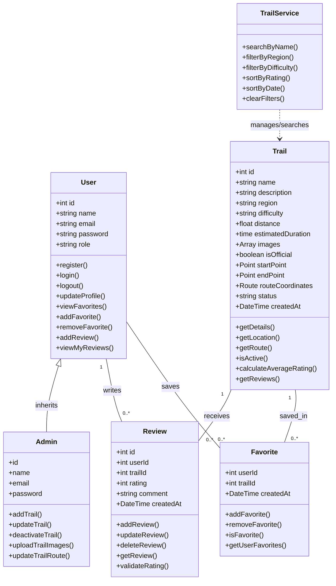
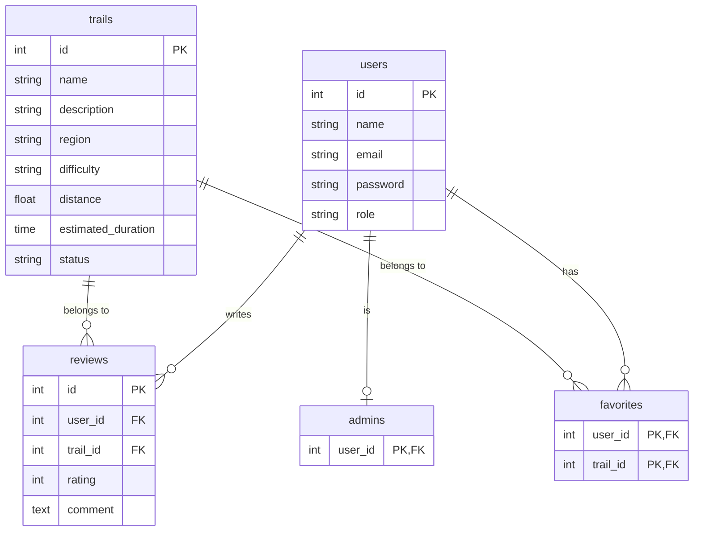

# 2. Components, Classes, and Database Design

## 2.1 Back-End Design (Classes & Methods)

### Class Descriptions:
- **User:** Represents system users (Hikers).
- **Admin:** Extends `User` with administrative privileges (e.g., managing trails).
- **Trail:** Represents trail routes and their attributes.
- **Review:** Manages user ratings and feedback for trails.
- **Favorite:** Manages user saved trails.
- **TrailService:** Utility class for searching, filtering, and sorting trails.

## 2.2 Database Design (Relational ERD)

---

## 2.3 Front-End UI Components

| Component Name | Description | Interactions |
| :--- | :--- | :--- |
| **AuthForms** | Handles user registration and login. | Submits user credentials to API to get Auth Tokens. |
| **TrailCardList** | Displays cards for available trails with search/filter controls. | Triggers `TrailService` filters (Difficulty, Region, Rating). |
| **TrailDetailsView** | Shows full information for a selected trail including route maps. | Fetches route coordinates and displays reviews. |
| **ReviewSection** | Displays user reviews and provides a form to add new reviews. | Submits new ratings and updates average rating dynamically. |
| **FavoriteButton** | Toggle button to save or remove trails from user favorites. | Sends request to `Favorite` API endpoint. |
